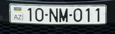
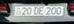
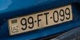
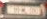
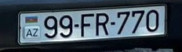
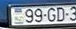
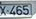
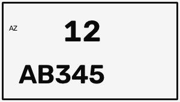

# Crop and layout checks

## Multiple vehicles

Three real photographs with multiple vehicles were checked. Every crop below uses a YOLO box with 8% padding, clipped to image bounds. Saved pixels were compared with the corresponding slice of the source image. All seven crops matched.

| Image | Split | Model detections | Crops checked |
|---|---|---:|---:|
| car_5 | development | 2 | 2 |
| car_23 | development | 2 | 2 |
| car_25 | test | 3 | 3 |

The count is the number of detections, not the number of successfully read plates. Some background plates are too small, cropped by the image edge or missed entirely.

car_5, main and background:

car_23, main and background:

car_25, main and two partial background plates:

## Two-line OCR

The supplied photos have single-line primary plates. These three synthetic crops check row ordering and the OCR hand-off only; they do not measure the detector on real two-line vehicle photographs and are excluded from all reported dataset accuracy.

| Top / bottom | OCR result | Correct |
|---|---|---|
| 12 / AB345 | 12AB345 | yes |
| 90 / XY678 | 90XY678 | yes |
| 77 / RZ144 | 77RZ144 | yes |

Structured results are in [crop_checks.json](crop_checks.json). Unit tests additionally cover row ordering, clipped boxes, no detections, ambiguous text, missing characters, metric denominators and parking-log deduplication.
