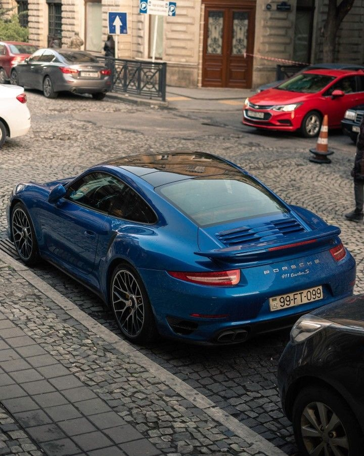
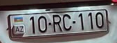

# Failure examples

The current set contains 25 images and 26 labeled plates. Detection found 20 plates at IoU >= 0.5. EasyOCR read 12 exactly. The detector was trained on different Brazilian images, so the Azerbaijani photos expose a change in plate shape, scene composition and lighting. The explanations below are based on visual inspection.

## car_5: detector miss

The foreground plate is `99FT099`, but no box was returned. It is angled and occupies a small part of the scene. The detector missed it, so OCR was not called. Manually supplying the known annotation as a crop would hide the detection failure; the pipeline does not do that.

## car_11: night-time OCR error

The expected text is `10RC110`; the cleaned result is `NRCM`. The model located a plate, but the night-time crop has strong illumination differences and the OCR reading lost several characters. It fails the format check. A regex cannot reconstruct the missing text.

## car_25: blur and reflections

Expected `PJI7589`; returned `PJ7533`. The crop includes the plate, but soft detail and reflections make characters hard to separate. The six-character reading is flagged invalid. The model result is retained rather than replaced with the annotation.

All per-plate outcomes, including missed plates, are in [easyocr.csv](easyocr.csv). [tesseract.csv](tesseract.csv) contains the comparison on identical detector crops. These are the current 25-image results; no scores from the removed dataset are carried forward.
