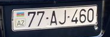
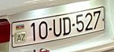

# Failure cases

These are actual held-out EasyOCR failures from the final pipeline. Crops below come from model detections with padding. Explanations describe visible causes; they are not certainty estimates from the models.

## 1. car_15: unusual digit shape

Expected `77AJ460`; output `77AJ260`. The detector found the plate (IoU 0.834), but the open, slanted `4` became `Z` in raw OCR (`AZ 77AJZ60`). The digit-position rule then changed `Z` to `2`. Both answers match the regex, so format validation cannot decide which is right.

## 2. car_37: repeated narrow characters

Expected `11LX111`; output `EMLX`. The crop contains the full plate (IoU 0.863), but OCR loses the repeated `1` characters. The crop-to-recognizer step, not localization, fails. The pipeline does not fill in missing digits from ground truth.

## 3. car_53: angled plate and border noise

Expected `10UD527`; output `70UD527`. Detection IoU is 0.878. Raw OCR is `70UD5273`: the slanted first `1` becomes `7`, and a border artifact becomes an extra trailing character. Removing the extra glyph restores the length, but cannot correct the first digit.

## Other errors

`car_36` and `car_39` show the same plate, `77ES425`, and remain together in the test split. They produce `77ES225` and `77ES423`. This illustrates why two views of the same car must not be split between development and test.

The small background plate `10FY911` in `car_43` is missed by the detector. Partial/unreadable background plates are kept in detection metrics, but their text is not guessed for OCR ground truth. A false detection in `car_12` also lowers precision and whole-image accuracy.

The 34 development primary plates are all correct; the held-out result is lower. A lower error rate needs broader, independent examples of plate fonts, viewing angles and two-line plates. The 53/58 collection score does not establish a 1–2 error limit on unseen photos.
