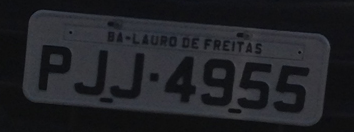
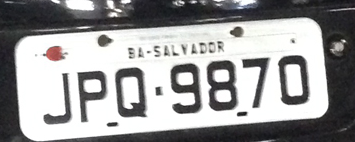
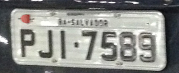

# Failure analysis

EasyOCR read 23 of 30 test plates exactly. All 30 model boxes passed IoU 0.5, so the seven end-to-end errors came from recognition. These are three of the actual test failures; the explanations below are based on visual inspection, not a claim to know the model's internal cause.

## Dark plate: PJJ4955

Expected `PJJ4955`; returned `PJJ7955`. IoU: **0.873**. The crop includes the whole plate, but the image is dark and the `4` was read as `7`. This is a digit-to-digit error, so the letter/digit correction cannot fix it. The result passes the format regex and is still wrong.

[Full prediction](easyocr/PJJ4955.jpg)

## Angled plate: JPQ9870

Expected `JPQ9870`; returned `JPO3870`. IoU: **0.792**. The plate is tilted; OCR confused `Q` with `O` and `9` with `3`. Padding preserved the corners but did not straighten the plate. Rotation augmentation helps detection; it does not guarantee correct character recognition.

[Full prediction](easyocr/JPQ9870.jpg)

## Blur and reflections: PJI7589

Expected `PJI7589`; returned `PJ7533`. IoU: **0.798**. The crop is soft and reflective. OCR dropped a character and confused the last digits. The six-character result is flagged invalid. The pipeline returns the observed result rather than filling in missing characters from the test labels.

[Full prediction](easyocr/PJI7589.jpg)

## Controlled difficult inputs

The [case checks](cases.md) also apply blur, a 20-degree rotation, and a partial mask to a test image. These modified images are explicitly synthetic stress checks and are excluded from the 30-image accuracy report. With partial occlusion, the detector returned no boxes, so OCR was not called.

## Tesseract comparison

Tesseract 5.4.0 with English, OEM 3 and PSM 7 read **1/30** plates exactly on the identical model crops; EasyOCR read **23/30**. PSM 7 treats the input as one text line, while these plates also contain small state labels, borders and bolts. Several crops produced empty output. This is a fixed baseline comparison, not a general claim that Tesseract cannot read plates. Its settings were not tuned on the held-out test set. EasyOCR is the default used by the program.
