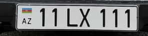

# Plate recognition report

24 held-out test images. Boxes come from YOLOv8; labels are used only to check results.

| OCR | Mean IoU | Precision | Recall | Exact match | CER | Whole-image accuracy |
|---|---:|---:|---:|---:|---:|---:|
| easyocr | 0.7606 | 96.4% | 90.0% | 19/25 (76.0%) | 0.0914 | 62.5% |
| tesseract | 0.7606 | 96.4% | 90.0% | 12/25 (48.0%) | 0.3600 | 41.7% |

easyocr: the main plate is correct in **19/24** images. The table above also counts background plates.

IoU checks box overlap. Missed boxes add zero to mean IoU. A correct detection needs IoU >= 0.5. Exact match means the full text is correct. CER is character edits / expected characters; missed text counts as deleted characters.

Unreadable/partial plates count for detection only. Plates below 25 x 8 pixels are outside the test scope. Extra detections lower precision and whole-image accuracy. Both OCR tools use the same model boxes.

## Results

easyocr output. Box order: left, top, right, bottom. Raw text is shown before cleaning.

| Image | Expected | Model box | Raw OCR | Clean text | Result |
|---|---|---|---|---|---|
| car_3.png | 90OT012 | 294, 569, 495, 623 | 900T012 | 90OT012 | correct |
| car_9.png | 20CT700 | 207, 747, 343, 783 | 4 20CT700 | 20CT700 | correct |
| car_12.png | 55CE155 | 136, 640, 242, 688 | 55CE155 | 55CE155 | correct |
| car_12.png | - | 49, 550, 284, 645 | - | - | false_positive |
| car_15.png | 77AJ460 | 397, 545, 555, 598 | AZ 77AJZ60 | 77AJ260 | ocr_error |
| car_17.png | 90PU029 | 389, 673, 560, 727 | AZ 90PU029 | 90PU029 | correct |
| car_18.png | 90UN023 | 468, 848, 598, 897 | 90UN0231 | 90UN023 | correct |
| car_22.png | 90ZC025 | 211, 573, 345, 615 | 90ZC025 | 90ZC025 | correct |
| car_25.png | 99FR770 | 366, 798, 565, 855 | 99FR770 | 99FR770 | correct |
| car_25.png | (unreadable/partial) | 0, 443, 33, 459 | Z65 | Z65 | detection_only |
| car_25.png | (unreadable/partial) | 666, 558, 736, 582 | 99G03 | 99G03 | detection_only |
| car_27.png | 99RT100 | 128, 769, 235, 812 | 99RT100 | 99RT100 | correct |
| car_27.png | (unreadable/partial) | - | - | - | miss |
| car_31.png | 42CL107 | 304, 730, 483, 773 | ES 42CL107 | 42CL107 | correct |
| car_31.png | (unreadable/partial) | 673, 666, 735, 687 | - | - | detection_only |
| car_35.png | 99FV543 | 264, 685, 488, 744 | 99FV543 | 99FV543 | correct |
| car_35.png | (unreadable/partial) | - | - | - | miss |
| car_36.png | 77ES425 | 306, 693, 471, 737 | 42 77ESZ25 | 77ES225 | ocr_error |
| car_37.png | 11LX111 | 236, 743, 490, 805 | EMLX | EMLX | ocr_error |
| car_38.png | 90XC832 | 513, 801, 630, 842 | 90XC832 | 90XC832 | correct |
| car_39.png | 77ES425 | 368, 682, 538, 727 | 477ES423 | 77ES423 | ocr_error |
| car_40.png | 99MT073 | 428, 757, 622, 817 | 99MT073 | 99MT073 | correct |
| car_41.png | 10ON010 | 239, 225, 436, 268 | 10ON010 | 10ON010 | correct |
| car_42.png | 01AA001 | 192, 681, 299, 715 | F01AA001 | 01AA001 | correct |
| car_43.png | 99DU911 | 185, 648, 361, 704 | 99DU911 | 99DU911 | correct |
| car_43.png | 10FY911 | - | - | - | miss |
| car_49.png | 77SG387 | 68, 764, 184, 814 | 877SG387 | 77SG387 | correct |
| car_51.png | 77SX585 | 361, 524, 536, 588 | 77SX585 | 77SX585 | correct |
| car_52.png | 77KG155 | 303, 765, 469, 813 | E77KG155 | 77KG155 | correct |
| car_53.png | 10UD527 | 477, 718, 601, 774 | 70UD5273 | 70UD527 | ocr_error |
| car_56.png | 77YH502 | 420, 571, 520, 601 | 77YH502 | 77YH502 | correct |

## Failure examples

These crops use model boxes, not hand-drawn boxes. Causes below describe likely OCR problems.

### car_15.png

Expected `77AJ460`; read `77AJ260`. OCR reads an open 4 as Z; the digit rule changes Z to 2. The wrong digit still passes the format check.

### car_37.png

Expected `11LX111`; read `EMLX`. The box covers the plate, but OCR drops or adds characters. Repeated narrow characters can merge. The format rule cannot restore missing text.

### car_53.png

Expected `10UD527`; read `70UD527`. The box covers the plate, but OCR confuses similar character shapes. A wrong digit can still pass the format check.

## Other checks (saved validation)

58 supplied photos: 34 development, 24 test. The same plate stays in one split. No weights were trained on these photos. Across both splits, 53/58 main plates were correct; this is not the held-out score.

Multiple vehicles: car_5 (2 crops), car_23 (2), car_25 (3). All 7 model crops had 8% padding, stayed within image bounds and matched the source pixels. Some background text was unreadable.

Two-line OCR: 12/AB345, 90/XY678 and 77/RZ144 all passed on synthetic crops. Real two-line vehicle photos were not available.

Tesseract is optional. The saved comparison used version 5.4.0, extracted locally because its installer could not run. EasyOCR needs only pip installation.

Settings: image size 960; confidence 0.25; crop padding 8%.

Model SHA-256: `2d95861825bb4184404344c9cf809f40fd31dba785fe54e8ba5b9a3583789822`

Labels SHA-256: `a33a76aab546218ccca0572057d9342cd9ef27343b100737c13a3d3e3cc3d378`
